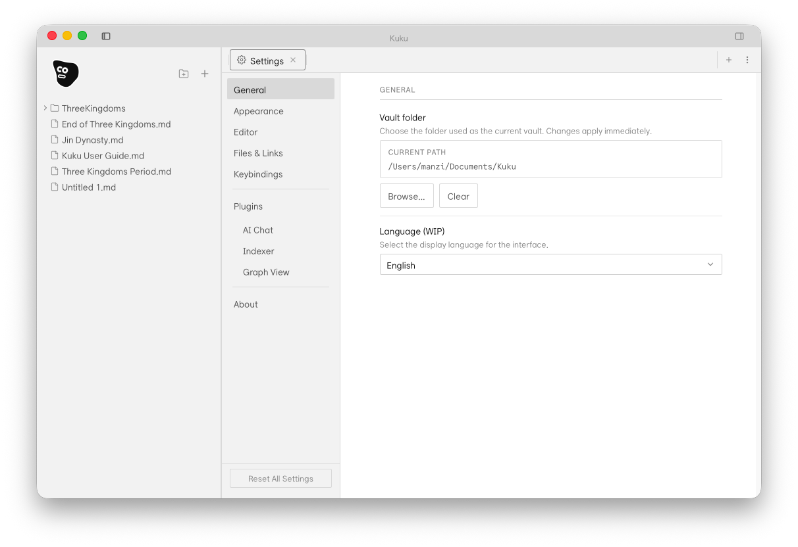
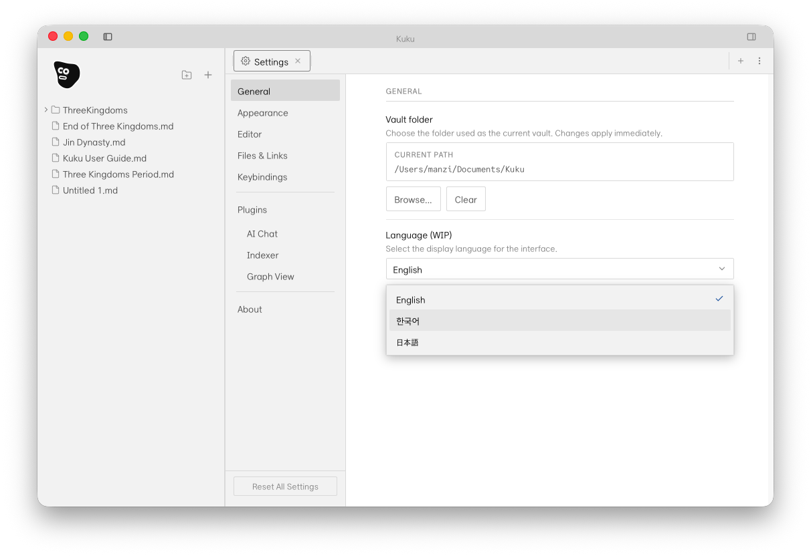
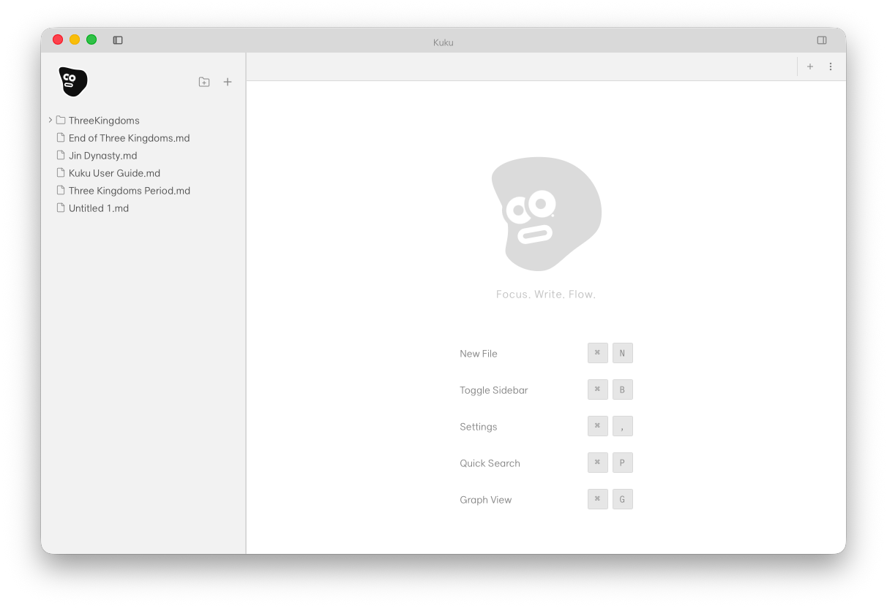

# Kuku

English | [한국어](README_ko.md)

A local-first markdown desktop app for focused thinking.

- **Desktop** — Tauri + SolidJS on macOS
- **AI** — in-app search/edit/link workflows with approval-based mutations
- **Data** — plain markdown files in your own vault

## Screens

<table>
  <tr>
    <th>Workspace Shell</th>
    <th>Provider Setup</th>
  </tr>
  <tr>
    <td></td>
    <td></td>
  </tr>
  <tr>
    <td>Desktop workspace with vault tree, editor surface, and utility rail.</td>
    <td>Provider/key setup and desktop-side AI configuration.</td>
  </tr>
  <tr>
    <th>Search Surface</th>
    <th>Search With Query</th>
  </tr>
  <tr>
    <td></td>
    <td></td>
  </tr>
  <tr>
    <td>Advanced search view for vault-wide lookup from inside the app.</td>
    <td>Search state after query input for fast discovery and navigation.</td>
  </tr>
</table>

## Why Kuku

- Local-first markdown editing on your own files
- Wikilinks, backlinks, and graph-based navigation
- AI workflows with explicit approval for file mutations
- Native app runtime via Tauri (not Electron)

## Quick start

```bash
pnpm install
pnpm --filter @kuku/desktop tauri:dev
```

## Repository layout

```text
apps/
  desktop/     Tauri desktop app (SolidJS frontend + Rust backend)
  web/         Astro site (landing/auth/dashboard)
  server/      Go API server (Connect RPC)
crates/
  kuku-ai/       AI integration
  kuku-contract/ RPC contract (Rust)
  kuku-indexer/  file indexing
packages/
  contract/    shared contract (gen/go + gen/ts)
infra/docker/
  local/       local stack (web + server + postgres + mailpit)
  preview/     staging
  prod/        production
```

## Contributing

Issues and PRs are welcome. For large changes, please open an issue first.

## License

[MIT](LICENSE) © kuku-mom
