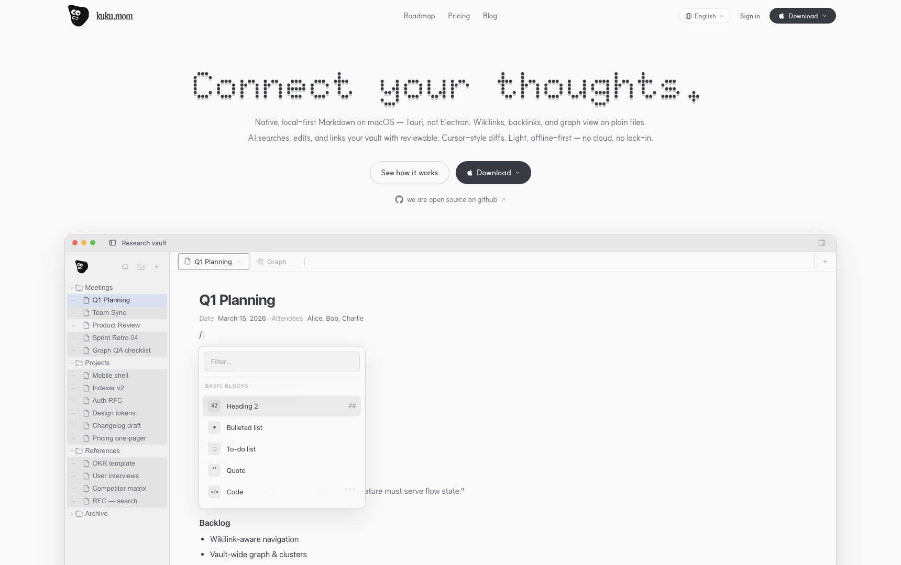

# Kuku

English | [한국어](README_ko.md)


A local-first markdown desktop app for focused thinking.

Kuku combines plain-file markdown editing, wikilinks/backlinks, graph view, and built-in AI workflows (search, edit, linking) in a native Tauri app shell.

Supports **macOS** today. Windows/Linux are on the roadmap.



## Why Kuku

Kuku exists for people who want modern AI-assisted workflows without giving up file ownership.

What it handles for you:
- Local-first markdown editing on your own vault
- Wikilinks, backlinks, and graph navigation
- Cursor-style AI editing with reviewable approval diffs
- Built-in search + context retrieval from your notes
- Tauri-based native desktop runtime (not Electron)

## Quick start

```bash
pnpm install
pnpm --filter @kuku/desktop tauri:dev
```

Build desktop bundle:

```bash
pnpm --filter @kuku/desktop tauri build --config apps/desktop/src-tauri/tauri.conf.json
```

Workspace checks:

```bash
pnpm check
pnpm test
```

## Desktop-focused architecture

```text
apps/desktop/          # Tauri desktop app (SolidJS frontend + Rust backend)
apps/server/           # Go API server (auth, AI endpoints, sync helpers)
apps/web/              # Website/auth/dashboard (non-core to desktop runtime)
crates/kuku-ai/        # AI integration layer
crates/kuku-indexer/   # Vault indexing
packages/contract/     # Shared Connect/proto contract (Go + TS)
```

## Core app features

- **Editor**: markdown-first editor with slash menu, context menu, and wikilink insert.
- **Graph**: visual relationship graph + backlinks-aware navigation.
- **AI Chat**: in-app assistant with tool execution and explicit approval flow for mutations.
- **Vault UX**: fast file tree, tabs, keyboard actions, and local caching.

## Platform notes

- **macOS**: actively supported desktop target.
- **Windows/Linux**: planned; desktop architecture already structured for expansion.

## Contributing

Issues and PRs are welcome.
If you are planning large changes, open an issue first so we can align on scope.

## License

[MIT](LICENSE) © kuku-mom
